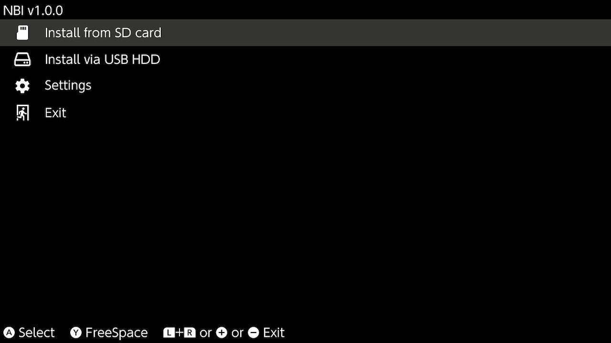

# NBI (No Bullshit Installer)



## Features
- Installs NSP/NSZ/XCI/XCZ files from SD card or USB hard drive.
- Minimal codebase, no bullshit.

## Building
```
$ podman run -it --rm --detach-keys=ctrl-\\ \
	-v PATH_TO_YOUR/NBI:/root/NBI devkitpro/devkita64
# cd /root/NBI
# make
```

## Thanks to
- Adubbz's Tinfoil
- MrDude's TinWoo
